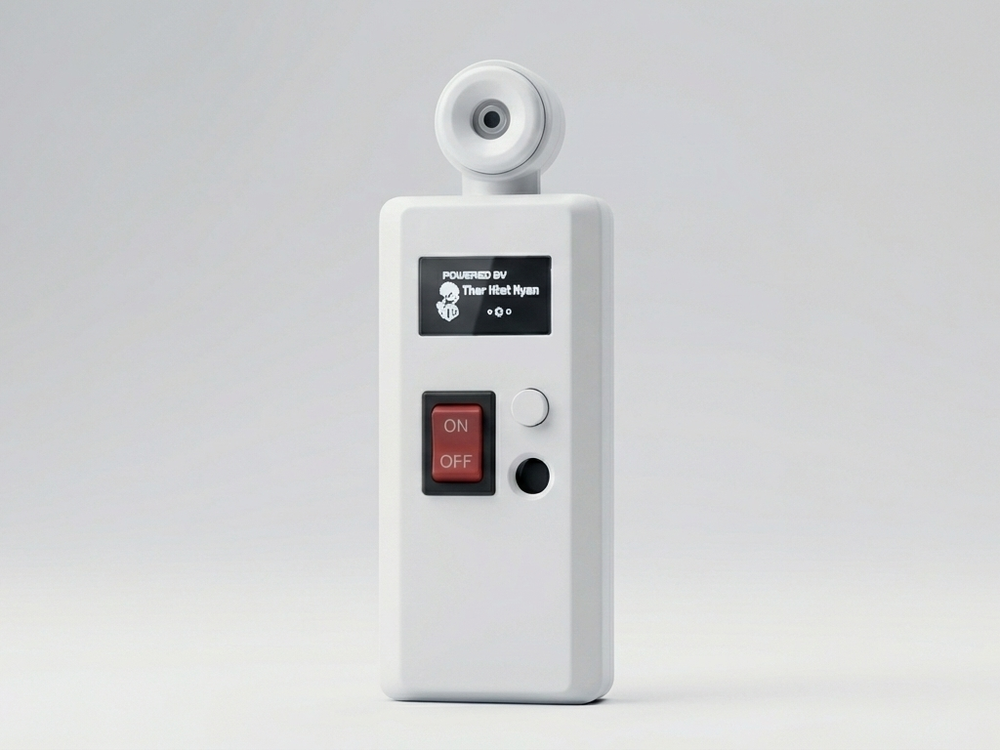
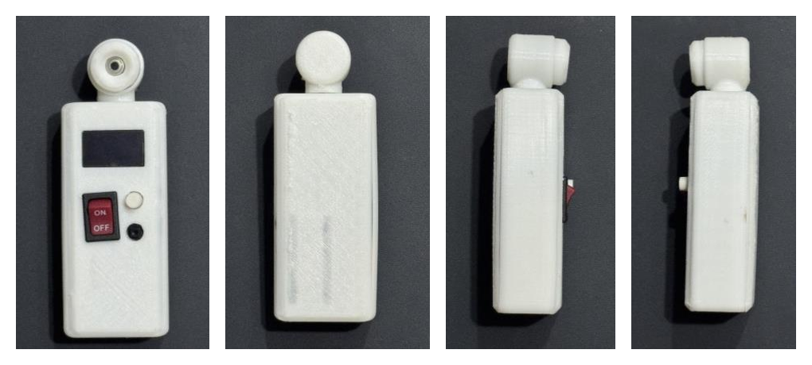
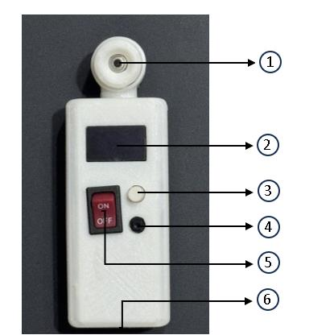
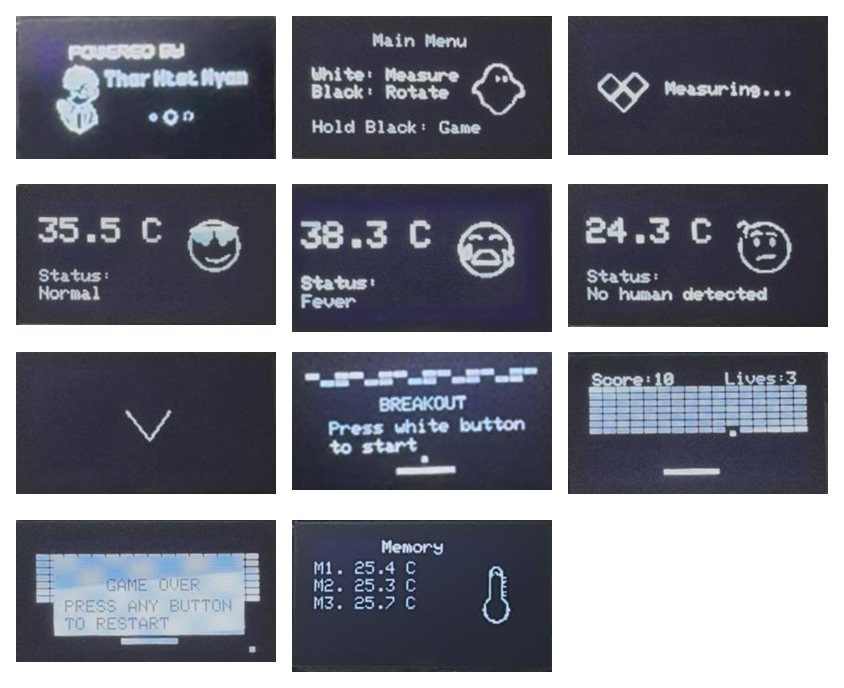
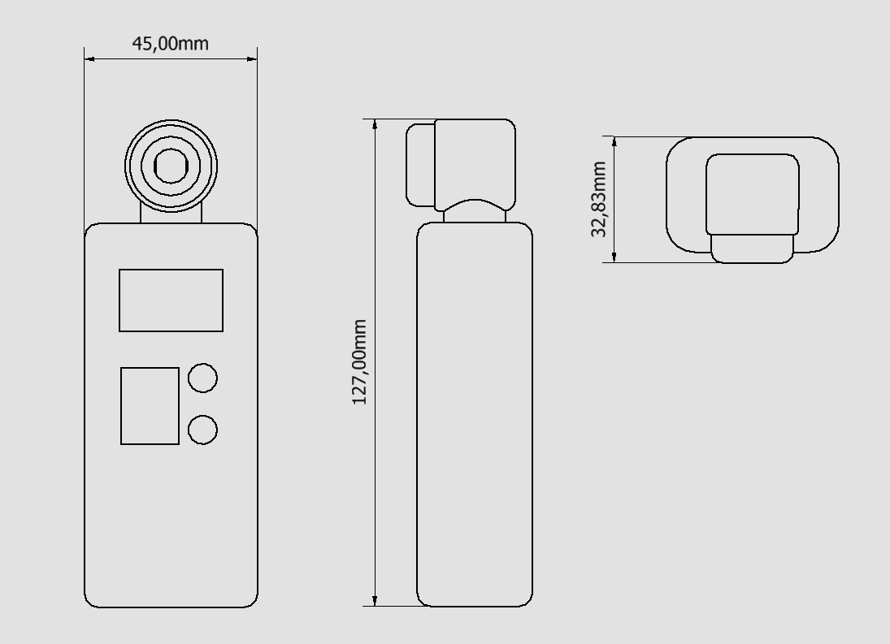
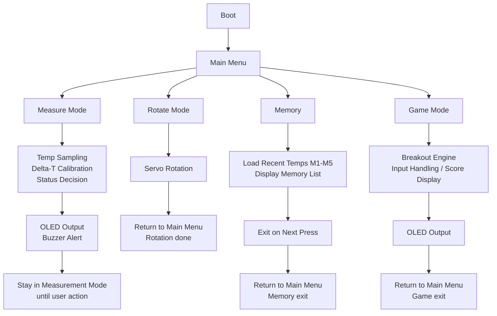

<div align="center">

# IR Thermometer
### Non-Contact Infrared Forehead Thermometer with Dual-Mode Sensing

*A capstone healthcare-device design project — Department of Biomedical Engineering, Soonchunhyang University*




</div>

---

## Overview

This project is a self-contained, non-contact infrared (IR) forehead thermometer built as a medical-device prototype for the *Healthcare Device Design (Capstone Design)* course. It measures the infrared radiation emitted by the forehead using an **MLX90614** contactless IR sensor, applies a calibrated compensation algorithm on an **STM32 Nucleo-L432KC** microcontroller, and reports body temperature on a **128x64 OLED** display with instant visual and audible status feedback.

Beyond core thermometry, the device includes a **motorized rotating sensor head** (driven by an SG90 servo) that physically turns between **self-measurement** and **other-person measurement** orientations, a **5-slot temperature memory log**, and a non-medical **Breakout mini-game** included purely as a user-engagement feature.

| | |
|---|---|
| Institution | Soonchunhyang University, College of Medical Sciences, Dept. of Biomedical Engineering |
| Course | 2025-2 Healthcare Device Design I (Capstone Design) |

---

## Gallery

### Device — Front / Back / Left / Right

<p align="center">
  
</p>

3D-printed PLA enclosure, designed in Autodesk Inventor. The sensor head sits on a rotating hinge driven by the internal servo.

### Labeled Component Diagram
 
<table>
<tr>
<td width="45%" align="center">
  
</td>
<td width="55%" valign="middle">
| # | Component | Function |
|---|---|---|
| 1 | IR sensor (MLX90614) | Detects forehead IR energy to measure surface temperature |
| 2 | Display (OLED) | Shows temperature, status, and mode |
| 3 | Measure button | Starts measurement, triggers multi-sampling |
| 4 | Sensor rotation button | Drives servo to rotate sensor between modes |
| 5 | Power switch (ON/OFF) | Turns the main power on/off |
| 6 | Charging port | Input for charging the internal battery |
 
</td>
</tr>
</table>

### OLED UI States

<p align="center">
  
</p>

Left to right, top to bottom: Boot, Main Menu, Measuring, Normal result, Fever result, No Human Detected, Rotate confirmation, Game start, Game play, Game over, Memory.

| # | Screen | Trigger | Description |
|---|---|---|---|
| 1 | Boot | Power ON | System initialization, sensor check, firmware load |
| 2 | Main Menu | After boot | Select Measure / Rotate / Game via button prompts |
| 3 | Measuring | Measure pressed | Live sampling animation with "Measuring…" prompt |
| 4 | Normal | Temp in normal range | Final temperature, relaxed icon, confirmation tone |
| 5 | Fever | Temp at/above fever threshold | Final temperature, warning icon, alert tone |
| 6 | No Human Detected | Reading outside human-temp range | Warning message, alert tone |
| 7 | Rotate confirmation | Rotate button pressed | Shown while the servo rotates the sensor 180°; auto-returns to Main Menu or Measure screen when done |
| 8 | Game Start (Breakout) | Long-press black button | Breakout intro screen; press white button to start |
| 9 | Game Play | During Breakout | Live block layout, paddle, score, and remaining lives |
| 10 | Game Over | Paddle/ball lost | "GAME OVER" with restart prompt; press both buttons to return to Main Menu |
| 11 | Memory (M1-M5) | Long-press white button | Last 5 stored readings, newest first, auto-exits after 10s |

### Mechanical Dimensions

<table>
<tr>
<td width="60%" align="center">
  
</td>
<td width="40%" valign="middle">

| Spec | Value |
|---|---|
| Width (W) | 45.00 mm |
| Depth (D) | 32.83 mm |
| Height (H) | 127.00 mm |
| Weight | 50 g |

</td>
</tr>
</table>

---

## Key Features

- Non-contact IR temperature sensing via MLX90614, corrected for human skin emissivity (0.98)
- Max-peak multi-sampling — takes several readings per measurement and reports the highest stable value
- Motorized sensor rotation for switching between self-measurement and other-person measurement modes
- Real-time OLED UI with status icons (Normal / Fever / High Fever / No Human Detected) and buzzer alerts
- On-device memory — stores and displays the last 5 readings (M1-M5)
- Built-in Breakout game as a non-medical, user-engagement extra (fully isolated from measurement logic)
- Rechargeable Li-Po power system with USB charging (TP4056) and 5V boost regulation
- Custom 3D-printed PLA enclosure, designed in Autodesk Inventor for a compact handheld form factor

---

## How It Works

1. The MLX90614 IR sensor continuously reads the forehead's radiated infrared energy and ambient temperature.
2. The Nucleo-L432KC (ARM Cortex-M4) MCU applies a pre-validated linear delta-T calibration equation to the raw signal.
3. A skin emissivity correction factor (0.98) is applied to convert the corrected signal into an actual temperature value.
4. The system performs multiple samples per measurement and selects the maximum peak value as the final reading (improves measurement stability).
5. The result and a status classification (Normal / Fever / High Fever / No Human Detected) are rendered on the OLED with a matching icon animation, and the buzzer plays a status-specific alert tone.

```
Forehead IR Radiation
        |
        v
 MLX90614 IR Sensor  -->  Raw IR signal + Ambient temp
        |
        v
 Nucleo-L432KC MCU
   - Delta-T linear calibration
   - Emissivity correction (0.98)
   - Multi-sample -> Max-peak selection
        |
        v
 Final Temperature --> OLED Display + Buzzer Alert
```

---

## Hardware & Bill of Materials

| # | Component | Part / Spec | Qty | Function |
|---|---|---|---|---|
| 1 | OLED Display | 0.96", 128x64, I2C | 1 | Status & UI display |
| 2 | Enclosure | PLA, 3D-printed (Autodesk Inventor) | 1 | Housing |
| 3 | Buttons | Power / Measure / Rotate switches | 3 | User input |
| 4 | IR Temperature Sensor | MLX90614, non-contact, emissivity 0.98 | 1 | Temperature sensing |
| 5 | Servo Motor | Tower Pro SG90 | 1 | Sensor head rotation |
| 6 | Microcontroller | Nucleo-L432KC (ARM Cortex-M4) | 1 | System control |
| 7 | Battery | 3.7V Li-Po | 1 | Power source |
| 8 | Charging Module | TP4056, 5V USB | 1 | Battery charging |
| 9 | Boost Converter | 3.7V to 5V | 1 | Power regulation |
| 10 | Buzzer | Passive, 5V | 1 | Audible alerts |
| 11 | Wiring | I2C / power jumper set | - | Interconnects |
| 12 | Firmware | C++ (Keil Studio), v1.0 | 1 | Control, UI, calibration logic |

Design tools used: Autodesk Inventor (mechanical CAD) · KiCad / OrCAD / LTSpice (electronics, where applicable) · Keil Studio (embedded C++ firmware)

---

## Firmware Architecture



Controls:

| Input | Action |
|---|---|
| Power switch | Turns the device ON / OFF |
| White button (short press) | Starts a temperature measurement |
| White button (long press) | Opens Memory mode (last 5 readings) |
| Black button (short press) | Rotates the sensor (self <-> other-person mode) |
| Black button (long press) | Enters Breakout game mode |
| White + Black (simultaneous) | Exits game mode / returns to Main Menu |

---

## Technical Specifications

| Parameter | Value |
|---|---|
| Display | 128x64 graphic OLED |
| Measurement range (forehead) | 30 C to 45 C |
| Accuracy | +/-0.2 C (30-45 C) · +/-0.4 C (outside this range) |
| Systematic error | +/-0.5 C |
| Random error | +/-0.2 C (30-45 C) |
| Combined uncertainty (Ux) | +/-0.54 C |
| Resolution | 0.1 C |
| Measurement method | Non-contact IR radiation (MLX90614), emissivity 0.98 |
| Measurement time | approx. 3 seconds |
| Durability | 30,000+ button cycles · 10,000+ servo rotation cycles |
| Rated voltage | DC 5V (post-boost) |
| Input voltage | 3.7V Li-Po |
| Power consumption | 0.3-0.6 W (peaks briefly during servo motion) |
| Electric shock protection | Internally powered equipment; sensor contact area meets BF-applied-part structural safety level |
| Operating conditions | 10 C to 40 C, 30-75% RH |
| Storage conditions | -20 C to 60 C, up to 95% RH |

Built-in safety behaviors:
- Displays "No human detected" with an alert tone when the reading falls outside plausible human body-temperature range.
- Automatically halts on excessive servo motor load.

---

## Usage

### Before you start
- Power the unit on and confirm the OLED lights up correctly.
- Keep the IR sensor lens and surrounding area clean and free of dust, fingerprints, or residue.
- Make sure the subject's forehead is dry and free of sweat, cosmetics, or moisture.
- Let both the device and the subject acclimate to room temperature for at least 30 minutes before measuring.

### Taking a measurement
1. Press the white (Measure) button — the display switches to the live measurement screen.
2. Hold the sensor within about 1 cm of the center of the forehead.
3. The device automatically multi-samples and selects the peak value (approx. 3 seconds).
4. The OLED shows the final temperature, status (Normal / Fever / High Fever / No Human), and a matching icon.
5. Press the white button again to return to the Main Menu.

### Switching between self / other-person mode
- Press the black (Rotate) button to rotate the sensor head via the SG90 servo.
- The device returns to the Main Menu automatically once rotation completes.

### Reviewing memory
- Long-press the white button to open the Memory screen (last 5 readings, M1 = most recent).
- Press any button, or wait 10 seconds, to auto-return to the Main Menu.

### Game mode (non-medical)
- Long-press the black button to launch the built-in Breakout mini-game.
- Press white + black simultaneously to exit back to the Main Menu.

### Care & storage
- Store in a dry location, away from moisture, direct sunlight, and physical shock.
- Avoid chemical storage areas or environments with corrosive gases.
- Do not disassemble, modify, or reassemble the device.
- Dispose of the battery according to local regulations.

Note: Vigorous exercise, bathing, or outdoor activity can temporarily alter facial skin temperature. Wait at least 30 minutes before measuring for reliable results. If a reading is outside the expected range, consult a medical professional.

---

## Compliance & Test Standards

| Test | Standard |
|---|---|
| Temperature range display | ASTM E1965 (1998) |
| Accuracy | ASTM E1965 (1998) section 6.1.4 |
| Drop/impact resilience | ASTM E1965 (1998) section 6.3 |
| Digital display resolution | ASTM E1112 (1998) section 4.4.2.1 |
| Response time | KS P6002 (1999) section 8.5.3 |
| Electrical/mechanical safety | Common standards for electro-mechanical safety of medical devices |
| Electromagnetic safety | Common standards for EMC safety of medical devices |
| Biological safety | Common standards for biological safety of medical devices |

---

## Tech Stack

C++ · Keil Studio · STM32 Nucleo-L432KC · MLX90614 · I2C · SG90 Servo · OLED (SSD1306-class) · Autodesk Inventor · 3D Printing (PLA/FDM)

---

## Repository Structure

```
IR-Thermometer/
├── README.md      # Project overview, specs, usage, gallery
└── assets/        # Image files referenced by this README
```

---

## Author

Project team: Soonchunhyang University Healthcare Device Design Capstone Team
Course: Healthcare Device Design I (Capstone Design), 2025-2
Department: Dept. of Biomedical Engineering, College of Medical Sciences

---

<div align="center">
<sub>Built as an academic capstone prototype. Not a certified consumer medical device.</sub>
</div>
